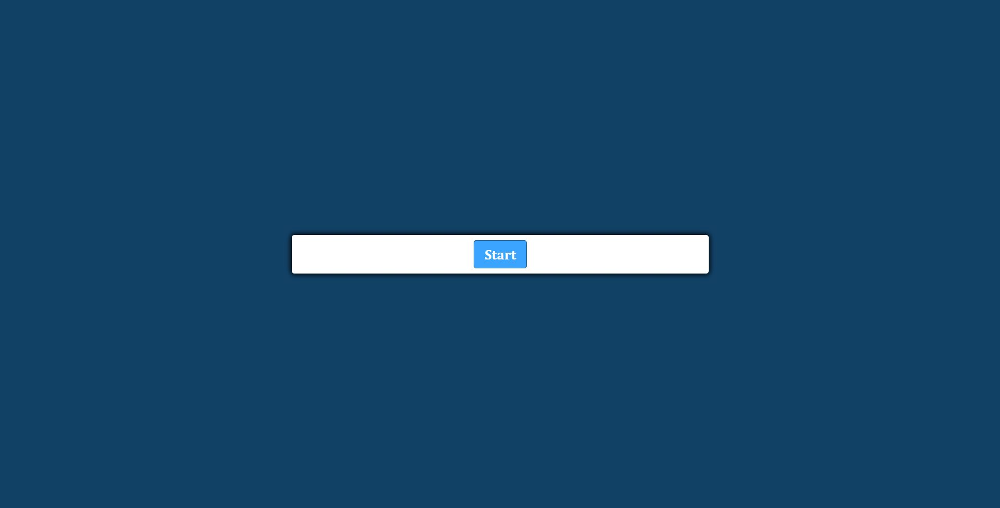

# Coding-Quiz

## Description

Timed coding quiz that has multiple-choice questions.

## Links

[Deployed website]()

[Github]()

## Installation

N/A

## Usage

Click on the "Start" button, and answer the questions that appear. When you click on the correct answer, the box will turn green to show that you chose the correct choice. If the answer is wrong
the button will turn red.

## Credits

[YouTube](https://www.youtube.com)
[W3Schools](https://www.w3schools.com)
[Google](https://www.google.com)

## License

N/A
